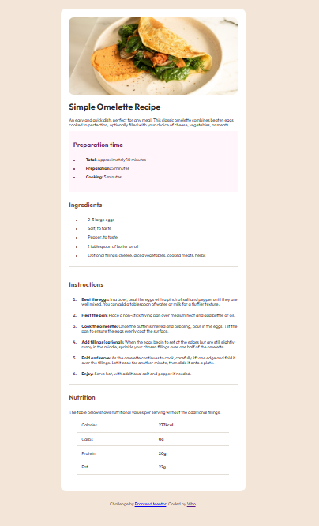
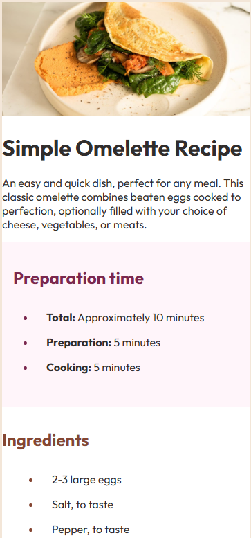

# Frontend Mentor - Recipe page solution

This is a solution to the [Recipe page challenge on Frontend Mentor](https://www.frontendmentor.io/challenges/recipe-page-KiTsR8QQKm). Frontend Mentor challenges help you improve your coding skills by building realistic projects.

## Overview

### Screenshot




### Links

- Live Site URL: [https://recipe-page-one-olive.vercel.app/]()

## My process

### Built with

- Semantic HTML5 markup
- CSS custom properties
- Responsive design for mobile and desktop

### What I learned

This project was a great opportunity to practice fundamental CSS concepts. I focused on creating a responsive layout that adapts from desktop to mobile.

One key learning was using CSS custom properties to manage the color palette, which made it easy to maintain consistency.

```css
:root {
  --white: hsl(0, 0%, 100%);
  --stone-100: hsl(30, 54%, 90%);
  --brown-800: hsl(14, 45%, 36%);
  --rose-800: hsl(332, 51%, 32%);
}
```

### Continued development

In future projects, I want to focus on:

- Exploring more advanced CSS layout techniques like CSS Grid and Flexbox.

## Author

- Frontend Mentor - [@Vibo](https://www.frontendmentor.io/profile/viboverse)
